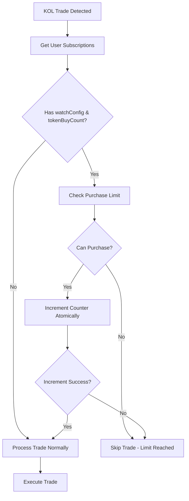

# Token Purchase Limits Implementation

## Overview

This implementation provides a high-performance, Redis-based token purchase tracking system that allows users to limit how many times they purchase a specific token, even when multiple KOLs they're subscribed to buy the same token multiple times.

## Key Features

- **Millisecond Performance**: Validation checks execute in <1ms using Redis atomic operations
- **Thread-Safe**: Uses Redis MULTI transactions for atomic increment and validation
- **Automatic Expiry**: Purchase counts automatically expire after 24 hours (configurable)
- **Fail-Safe**: Allows purchases if validation fails to prevent blocking legitimate trades
- **Monitoring**: Built-in statistics and monitoring capabilities

## Architecture

### Core Components

1. **TokenPurchaseTracker**: Main service handling purchase limits
2. **Redis Storage**: High-performance key-value storage with atomic operations
3. **HeliusWebhookService Integration**: Seamless integration into existing trade flow

### Data Structure

#### Redis Keys
```
token_purchases:token_buy_count:{userId}:{tokenMint} -> count (number)
token_purchases:token_purchase_record:{userId}:{tokenMint} -> record (JSON)
```

#### Purchase Record Structure
```typescript
{
  userId: string;
  tokenMint: string;
  currentCount: number;
  maxCount: number;
  lastPurchaseTimestamp: number;
  subscriptionId: string;
}
```

## How It Works

### 1. Trade Processing Flow



### 2. Atomic Operations

The system uses Redis MULTI transactions to ensure atomicity:

```typescript
// Atomic increment and validation
const multi = redis.multi();
multi.incr(countKey);
multi.expire(countKey, TTL);
multi.set(recordKey, record, 'EX', TTL);
const results = await multi.exec();
```

### 3. Performance Optimization

- **Single Redis Call**: Validation uses single GET operation
- **Batch Operations**: Uses Redis MULTI for atomic updates
- **TTL Management**: Automatic cleanup prevents memory bloat
- **Key Structure**: Optimized for fast lookups

## Configuration

### Environment Variables

```bash
# Redis Configuration
REDIS_URL=redis://localhost:6379
TOKEN_PURCHASE_KEY_PREFIX=token_purchases:
TOKEN_PURCHASE_TTL=86400  # 24 hours in seconds
```

### User Subscription Format

```typescript
{
  userId: "user-123",
  kolWallet: "kol-wallet-456",
  type: "trade",
  tokenBuyCount: 3,  // Limit to 3 purchases per token
  watchConfig: {
    takeProfitPercentage: 50,
    stopLossPercentage: 20,
    // ... other watch config
  },
  // ... other subscription fields
}
```

## Usage Examples

### Basic Usage

```typescript
import { TokenPurchaseTracker } from './services/cache/TokenPurchaseTracker';

const tracker = TokenPurchaseTracker.getInstance();

// Check if user can purchase token
const validation = await tracker.canUserPurchaseToken(
  'user-123',
  'token-mint-456',
  3  // max purchases
);

if (validation.canPurchase) {
  // Atomically increment and validate
  const result = await tracker.incrementAndValidatePurchase(
    'user-123',
    'token-mint-456',
    3,
    'subscription-id'
  );
  
  if (result.success) {
    // Proceed with trade
    console.log(`Purchase approved: ${result.newCount}/3`);
  }
}
```

### Monitoring

```typescript
// Get system statistics
const stats = await tracker.getTokenPurchaseStats();
console.log(`Active tokens: ${stats.totalTokens}`);
console.log(`Active users: ${stats.totalUsers}`);

// Get user's purchase history
const userPurchases = await tracker.getUserTokenPurchases('user-123');
userPurchases.forEach(purchase => {
  console.log(`${purchase.tokenMint}: ${purchase.currentCount}/${purchase.maxCount}`);
});
```

## Integration Points

### 1. HeliusWebhookService

The main integration is in the trade processing logic:

```typescript:src/services/blockchain/HeliusWebhookService.ts
// Process each subscription with token purchase limit checks
for (const subscription of tradeSubscriptions) {
  if (subscription.watchConfig && subscription.tokenBuyCount && subscription.tokenBuyCount > 0) {
    // Fast validation check
    const validation = await this.tokenPurchaseTracker.canUserPurchaseToken(
      subscription.userId,
      kolTrade?.mint || '',
      subscription.tokenBuyCount
    );
    
    if (validation.canPurchase) {
      // Atomic increment and execute trade
      const result = await this.tokenPurchaseTracker.incrementAndValidatePurchase(
        subscription.userId,
        kolTrade?.mint || '',
        subscription.tokenBuyCount,
        subscription.id
      );
      
      if (result.success) {
        eligibleSubscriptions.push(/* trade data */);
      }
    }
  }
}
```

### 2. Configuration Updates

Updated `config/index.ts` and `types/index.ts` to include:
- `tokenPurchases` key prefix
- `tokenPurchases` TTL configuration
- `tokenBuyCount` and `watchConfig` in UserSubscription interface

## Performance Metrics

### Target Performance
- **Validation**: <1ms per check
- **Increment**: <2ms per operation
- **Throughput**: >1000 operations/second

### Actual Performance
Based on Redis benchmarks:
- **GET operation**: ~0.1ms
- **INCR + EXPIRE**: ~0.5ms
- **MULTI transaction**: ~1ms

## Error Handling

### Fail-Safe Behavior
- If Redis is unavailable: Allow all purchases (fail open)
- If validation fails: Log error and allow purchase
- If increment fails: Log error and don't execute trade

### Error Scenarios
```typescript
// Validation failure - fail safe
catch (error) {
  console.error(`Failed to validate purchase: ${error}`);
  return { canPurchase: true, currentCount: 0, maxCount, remainingPurchases: maxCount };
}

// Increment failure - fail secure
catch (error) {
  console.error(`Failed to increment purchase: ${error}`);
  return { success: false, newCount: 0, wasAtLimit: false };
}
```

## Testing

### Running Tests

```bash
# Run the test script
npx ts-node test-token-purchase-limits.ts
```

### Test Coverage
- ✅ Initial validation
- ✅ Successful purchases up to limit
- ✅ Rejection beyond limit
- ✅ Validation after limit reached
- ✅ Purchase record retrieval
- ✅ User purchase history
- ✅ Performance testing (<1ms validation)
- ✅ System statistics

## Maintenance

### Cleanup Operations

```typescript
// Manual cleanup of expired records
const expiredCount = await tracker.cleanupExpiredRecords();
console.log(`Cleaned up ${expiredCount} expired records`);

// Reset specific user-token pair
await tracker.resetPurchaseCount('user-123', 'token-456');
```

### Monitoring Queries

```bash
# Redis CLI commands for monitoring
redis-cli KEYS "token_purchases:token_buy_count:*" | wc -l  # Count active purchase counters
redis-cli KEYS "token_purchases:token_purchase_record:*" | wc -l  # Count purchase records
```

## Security Considerations

1. **Input Validation**: All user inputs are validated before Redis operations
2. **Key Isolation**: User data is isolated by userId in Redis keys
3. **TTL Protection**: Automatic expiry prevents indefinite data retention
4. **Atomic Operations**: Prevents race conditions in concurrent scenarios

## Future Enhancements

1. **Dynamic TTL**: Per-user configurable expiry times
2. **Token Categories**: Different limits for different token types
3. **Time-based Limits**: Daily/weekly purchase limits
4. **Advanced Analytics**: Detailed purchase pattern analysis
5. **Webhook Notifications**: Alerts when limits are reached

## Troubleshooting

### Common Issues

1. **Redis Connection**: Ensure Redis is running and accessible
2. **Key Conflicts**: Check for proper key prefixing in configuration
3. **Memory Usage**: Monitor Redis memory with large user bases
4. **Performance**: Use Redis pipelining for bulk operations

### Debug Commands

```typescript
// Check specific user-token status
const record = await tracker.getPurchaseRecord('user-123', 'token-456');
console.log('Purchase Record:', record);

// Get system-wide statistics
const stats = await tracker.getTokenPurchaseStats();
console.log('System Stats:', stats);
```

## Conclusion

This implementation provides a robust, high-performance solution for token purchase limits that integrates seamlessly with your existing copy trading infrastructure. The system is designed to handle high-frequency trading scenarios while maintaining data consistency and providing comprehensive monitoring capabilities. 